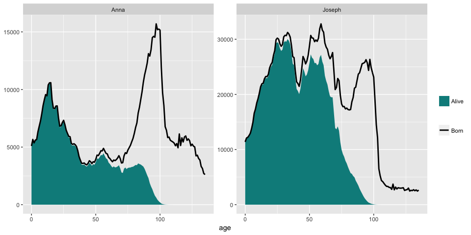
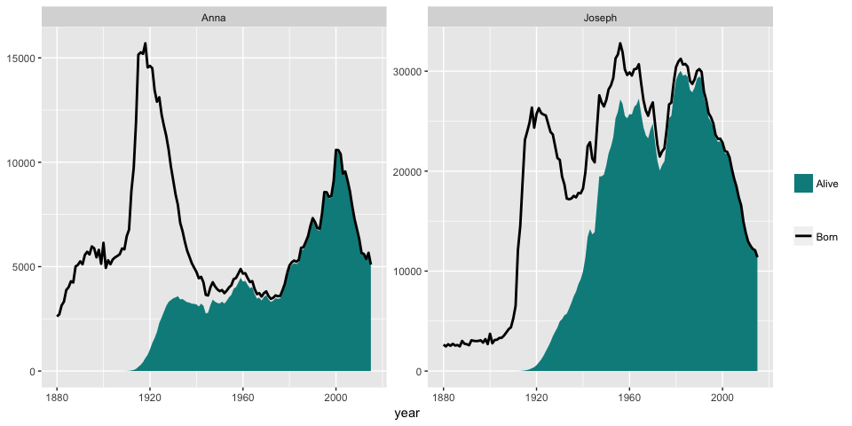

<!-- README.md is generated from README.Rmd. Please edit that file -->
nameage
-------

### Description

This packages uses the U.S. Social Security Administration's baby names dataset and actuarial tables to estimate the age of an American based on their first name. It uses datasets conveniently collected in the [babynames](http://github.com/hadley/babynames) package and follows the same general format as the [gender](https://github.com/ropensci/gender) package.

The most famous example of using names to estimate age probably comes from [FiveThirtyEight](https://fivethirtyeight.com/features/how-to-tell-someones-age-when-all-you-know-is-her-name/).

### Installation

To install from Github, use the following commands.

``` r
# install.packages("devtools")
devtools::install_github("andland/nameage")
```

### Using the package

The main function is `nameage()` which takes a vector of `names` as the first argument. There are two additional arguments:

-   `base_year`: Calculate the age effective at this year. It defaults to the last year of the SSA data (2015).
-   `age_range`: A range of ages to subset the analysis by. This can be useful if you know, for example, that the person is an adult.

The function returns a data frame with a row for each name it can find. It includes a summary of the age distribution, including the mean, standard deviation, first quartile, median, and third quartile. In addition, it includes the number of people born with the names, as well as an estimate of the number of people still alive at the reference year.

To start off, we will get the age of some names as of 2015. The `names` argument is not case sensitive.

``` r
library(nameage)
names = c("Ava", "liam", "Jack", "ELLA", "gertrude", "elmer", "Violet")

nameage(names, base_year = 2015)
#> # A tibble: 7 x 8
#>       name      n   n_alive      mean        sd    q1 median    q3
#>      <chr>  <int>     <dbl>     <dbl>     <dbl> <dbl>  <dbl> <dbl>
#> 1      Ava 218673 211933.04  8.565290 11.895632     3      6     9
#> 2     ELLA 281604 170996.91 23.702506 28.987314     4      9    47
#> 3    elmer 129647  34744.58 58.583760 24.460978    45     65    77
#> 4 gertrude 177359  28260.08 76.450368 14.851850    68     79    87
#> 5     Jack 670805 393056.09 38.155401 28.934937    10     35    65
#> 6     liam 155843 154631.51  6.160169  6.783567     2      4     9
#> 7   Violet 127793  59330.14 34.583680 35.197413     3     11    72
```

The average age of people with a given name changes depending on the effective year. People named Violet were in general much older in 1990 than they are today.

``` r
nameage(names, base_year = 1990)
#> # A tibble: 7 x 8
#>       name      n    n_alive     mean        sd    q1 median    q3
#>      <chr>  <int>      <dbl>    <dbl>     <dbl> <dbl>  <dbl> <dbl>
#> 1      Ava  16333  13598.669 36.21455 20.246055    23     35    48
#> 2     ELLA 156965  92272.773 55.17945 18.151856    43     58    69
#> 3    elmer 124568  71598.627 55.00142 17.462330    45     60    68
#> 4 gertrude 177020  93380.556 65.12151 13.443510    59     68    74
#> 5     Jack 489076 362527.842 46.42406 18.163925    34     49    61
#> 6     liam   3108   3038.564 10.64685  9.108123     3      8    16
#> 7   Violet  94798  64561.901 59.03853 16.903045    52     63    70
```

Looking at just working adults.

``` r
nameage(names, base_year = 2015, age_range = c(18, 65))
#> # A tibble: 7 x 8
#>       name      n    n_alive     mean        sd    q1 median    q3
#>      <chr>  <int>      <dbl>    <dbl>     <dbl> <dbl>  <dbl> <dbl>
#> 1      Ava  11473  10722.867 44.43247 15.521935    29     49    59
#> 2     ELLA  22364  20542.477 49.71888 14.131531    42     55    61
#> 3    elmer  16250  14255.575 47.78234 14.019756    38     52    60
#> 4 gertrude   5834   5244.547 56.11059  9.220711    53     59    63
#> 5     Jack 156823 138622.649 45.86359 15.170339    33     50    59
#> 6     liam   9808   9534.760 24.48821  8.921051    19     20    27
#> 7   Violet  10251   9515.762 46.84895 14.539712    34     51    59
```

The package also includes a function to plot the distribution of the ages for each name. In addition to a few arguments to control the plotting, there is an additional parameter `type` which tells whether to plot by age...

``` r
plot_nameage(c("Joseph", "Anna"), type = "age")
```



or by year.

``` r
plot_nameage(c("Joseph", "Anna"), type = "year")
```



### To do

-   Add the ability to subset by gender.
